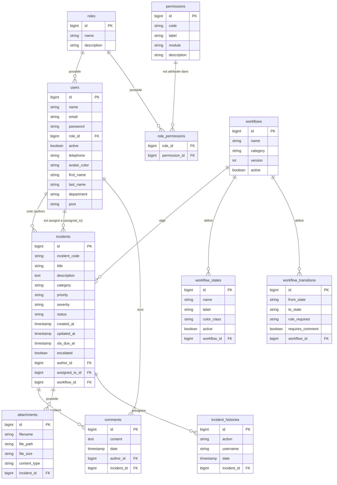

# 📐 Schéma de Base de Données - IncidentFlow

Ce document décrit le schéma relationnel de la base de données PostgreSQL de l'application **IncidentFlow**. Il comprend le diagramme d'entité-association (ERD Mermaid), les tables détaillées et les scripts DDL SQL.

---

## 📊 Diagramme d'Entité-Association (ERD)



---

## 📋 Dictionnaire des Tables & Colonnes

### 1. Utilisateurs & Sécurité

#### Table : `roles`
| Colonne | Type | Contraintes | Description |
| :--- | :--- | :--- | :--- |
| `id` | `BIGSERIAL` | `PRIMARY KEY` | Identifiant du rôle |
| `name` | `VARCHAR(255)` | `NOT NULL`, `UNIQUE` | Nom du rôle |
| `description` | `VARCHAR(500)` | `NULLABLE` | Description |

#### Table : `permissions`
| Colonne | Type | Contraintes | Description |
| :--- | :--- | :--- | :--- |
| `id` | `BIGSERIAL` | `PRIMARY KEY` | Identifiant de la permission |
| `code` | `VARCHAR(255)` | `NOT NULL`, `UNIQUE` | Code de la permission |
| `label` | `VARCHAR(255)` | `NOT NULL` | Libellé lisible |
| `module` | `VARCHAR(255)` | `NOT NULL` | Module associé |
| `description` | `VARCHAR(500)` | `NULLABLE` | Description |

#### Table : `role_permissions`
| Colonne | Type | Contraintes | Description |
| :--- | :--- | :--- | :--- |
| `role_id` | `BIGINT` | `FOREIGN KEY` (`roles.id`) | Clé étrangère vers `roles` |
| `permission_id` | `BIGINT` | `FOREIGN KEY` (`permissions.id`) | Clé étrangère vers `permissions` |

#### Table : `users`
| Colonne | Type | Contraintes | Description |
| :--- | :--- | :--- | :--- |
| `id` | `BIGSERIAL` | `PRIMARY KEY` | Identifiant de l'utilisateur |
| `name` | `VARCHAR(255)` | `NOT NULL` | Nom complet |
| `email` | `VARCHAR(255)` | `NOT NULL`, `UNIQUE` | Adresse email |
| `password` | `VARCHAR(255)` | `NOT NULL` | Mot de passe sécurisé |
| `role_id` | `BIGINT` | `FOREIGN KEY` (`roles.id`), `NOT NULL` | Rôle attribué |
| `active` | `BOOLEAN` | `NOT NULL DEFAULT TRUE` | État du compte |
| `telephone` | `VARCHAR(255)` | `NULLABLE` | Numéro de téléphone |
| `avatar_color` | `VARCHAR(255)` | `NULLABLE` | Couleur avatar |
| `first_name` | `VARCHAR(255)` | `NULLABLE` | Prénom |
| `last_name` | `VARCHAR(255)` | `NULLABLE` | Nom |
| `department` | `VARCHAR(255)` | `NULLABLE` | Département |
| `post` | `VARCHAR(255)` | `NULLABLE` | Poste |

---

### 2. Incidents & Événements

#### Table : `incidents`
| Colonne | Type | Contraintes | Description |
| :--- | :--- | :--- | :--- |
| `id` | `BIGSERIAL` | `PRIMARY KEY` | Identifiant |
| `incident_code` | `VARCHAR(255)` | `NOT NULL`, `UNIQUE` | Code unique de l'incident |
| `title` | `VARCHAR(255)` | `NOT NULL` | Titre |
| `description` | `TEXT` | `NOT NULL` | Description détaillée |
| `category` | `VARCHAR(255)` | `NOT NULL` | Catégorie |
| `priority` | `VARCHAR(255)` | `NOT NULL` | Priorité |
| `severity` | `VARCHAR(255)` | `NULLABLE` | Sévérité |
| `status` | `VARCHAR(255)` | `NOT NULL` | Statut de l'incident |
| `created_at` | `TIMESTAMP` | `NOT NULL` | Date de création |
| `updated_at` | `TIMESTAMP` | `NOT NULL` | Date de mise à jour |
| `sla_due_at` | `TIMESTAMP` | `NULLABLE` | Date limite SLA |
| `escalated` | `BOOLEAN` | `NOT NULL DEFAULT FALSE` | Escaladé ou non |
| `author_id` | `BIGINT` | `FOREIGN KEY` (`users.id`), `NOT NULL` | Déclarateur |
| `assigned_to_id` | `BIGINT` | `FOREIGN KEY` (`users.id`), `NULLABLE` | Assigné à |
| `workflow_id` | `BIGINT` | `FOREIGN KEY` (`workflows.id`), `NULLABLE` | Workflow associé |

#### Table : `comments`
| Colonne | Type | Contraintes | Description |
| :--- | :--- | :--- | :--- |
| `id` | `BIGSERIAL` | `PRIMARY KEY` | Identifiant du commentaire |
| `content` | `TEXT` | `NOT NULL` | Contenu |
| `date` | `TIMESTAMP` | `NOT NULL` | Horodatage |
| `author_id` | `BIGINT` | `FOREIGN KEY` (`users.id`), `NOT NULL` | Auteur du commentaire |
| `incident_id` | `BIGINT` | `FOREIGN KEY` (`incidents.id`), `NOT NULL` | Incident cible |

#### Table : `attachments`
| Colonne | Type | Contraintes | Description |
| :--- | :--- | :--- | :--- |
| `id` | `BIGSERIAL` | `PRIMARY KEY` | Identifiant de la pièce jointe |
| `filename` | `VARCHAR(255)` | `NOT NULL` | Nom du fichier |
| `file_path` | `VARCHAR(255)` | `NOT NULL` | Chemin sur le disque |
| `file_size` | `VARCHAR(255)` | `NULLABLE` | Taille |
| `content_type` | `VARCHAR(255)` | `NULLABLE` | Type MIME |
| `incident_id` | `BIGINT` | `FOREIGN KEY` (`incidents.id`), `NOT NULL` | Incident rattaché |

#### Table : `incident_histories`
| Colonne | Type | Contraintes | Description |
| :--- | :--- | :--- | :--- |
| `id` | `BIGSERIAL` | `PRIMARY KEY` | Identifiant |
| `action` | `VARCHAR(255)` | `NOT NULL` | Action exécutée |
| `username` | `VARCHAR(255)` | `NOT NULL` | Nom de l'utilisateur |
| `date` | `TIMESTAMP` | `NOT NULL` | Horodatage |
| `incident_id` | `BIGINT` | `FOREIGN KEY` (`incidents.id`), `NOT NULL` | Incident concerné |

---

### 3. Workflows

#### Table : `workflows`
| Colonne | Type | Contraintes | Description |
| :--- | :--- | :--- | :--- |
| `id` | `BIGSERIAL` | `PRIMARY KEY` | Identifiant |
| `name` | `VARCHAR(255)` | `NOT NULL` | Nom du workflow |
| `category` | `VARCHAR(255)` | `NOT NULL` | Catégorie cible |
| `version` | `INT` | `NOT NULL DEFAULT 1` | Version |
| `active` | `BOOLEAN` | `NOT NULL DEFAULT TRUE` | Actif |

#### Table : `workflow_states`
| Colonne | Type | Contraintes | Description |
| :--- | :--- | :--- | :--- |
| `id` | `BIGSERIAL` | `PRIMARY KEY` | Identifiant de l'état |
| `name` | `VARCHAR(255)` | `NOT NULL` | Code de l'état |
| `label` | `VARCHAR(255)` | `NOT NULL` | Libellé UI |
| `color_class` | `VARCHAR(255)` | `NULLABLE` | Classe CSS |
| `active` | `BOOLEAN` | `NOT NULL DEFAULT TRUE` | Actif |
| `workflow_id` | `BIGINT` | `FOREIGN KEY` (`workflows.id`), `NOT NULL` | Workflow rattaché |

#### Table : `workflow_transitions`
| Colonne | Type | Contraintes | Description |
| :--- | :--- | :--- | :--- |
| `id` | `BIGSERIAL` | `PRIMARY KEY` | Identifiant de la transition |
| `from_state` | `VARCHAR(255)` | `NOT NULL` | État initial |
| `to_state` | `VARCHAR(255)` | `NOT NULL` | État cible |
| `role_required` | `VARCHAR(255)` | `NULLABLE` | Rôle requis |
| `requires_comment` | `BOOLEAN` | `NOT NULL DEFAULT FALSE` | Commentaire requis |
| `workflow_id` | `BIGINT` | `FOREIGN KEY` (`workflows.id`), `NOT NULL` | Workflow rattaché |

---

## 🛠️ Script DDL SQL (PostgreSQL)

```sql
-- Structure de création des tables PostgreSQL

CREATE TABLE roles (
    id BIGSERIAL PRIMARY KEY,
    name VARCHAR(255) NOT NULL UNIQUE,
    description VARCHAR(500)
);

CREATE TABLE permissions (
    id BIGSERIAL PRIMARY KEY,
    code VARCHAR(255) NOT NULL UNIQUE,
    label VARCHAR(255) NOT NULL,
    module VARCHAR(255) NOT NULL,
    description VARCHAR(500)
);

CREATE TABLE role_permissions (
    role_id BIGINT NOT NULL REFERENCES roles(id) ON DELETE CASCADE,
    permission_id BIGINT NOT NULL REFERENCES permissions(id) ON DELETE CASCADE,
    PRIMARY KEY (role_id, permission_id)
);

CREATE TABLE users (
    id BIGSERIAL PRIMARY KEY,
    name VARCHAR(255) NOT NULL,
    email VARCHAR(255) NOT NULL UNIQUE,
    password VARCHAR(255) NOT NULL,
    role_id BIGINT NOT NULL REFERENCES roles(id),
    active BOOLEAN NOT NULL DEFAULT TRUE,
    telephone VARCHAR(255),
    avatar_color VARCHAR(255),
    first_name VARCHAR(255),
    last_name VARCHAR(255),
    department VARCHAR(255),
    post VARCHAR(255)
);

CREATE TABLE workflows (
    id BIGSERIAL PRIMARY KEY,
    name VARCHAR(255) NOT NULL,
    category VARCHAR(255) NOT NULL,
    version INT NOT NULL DEFAULT 1,
    active BOOLEAN NOT NULL DEFAULT TRUE
);

CREATE TABLE workflow_states (
    id BIGSERIAL PRIMARY KEY,
    name VARCHAR(255) NOT NULL,
    label VARCHAR(255) NOT NULL,
    color_class VARCHAR(255),
    active BOOLEAN NOT NULL DEFAULT TRUE,
    workflow_id BIGINT NOT NULL REFERENCES workflows(id) ON DELETE CASCADE
);

CREATE TABLE workflow_transitions (
    id BIGSERIAL PRIMARY KEY,
    from_state VARCHAR(255) NOT NULL,
    to_state VARCHAR(255) NOT NULL,
    role_required VARCHAR(255),
    requires_comment BOOLEAN NOT NULL DEFAULT FALSE,
    workflow_id BIGINT NOT NULL REFERENCES workflows(id) ON DELETE CASCADE
);

CREATE TABLE incidents (
    id BIGSERIAL PRIMARY KEY,
    incident_code VARCHAR(255) NOT NULL UNIQUE,
    title VARCHAR(255) NOT NULL,
    description TEXT NOT NULL,
    category VARCHAR(255) NOT NULL,
    priority VARCHAR(255) NOT NULL,
    severity VARCHAR(255),
    status VARCHAR(255) NOT NULL,
    created_at TIMESTAMP NOT NULL,
    updated_at TIMESTAMP NOT NULL,
    sla_due_at TIMESTAMP,
    escalated BOOLEAN NOT NULL DEFAULT FALSE,
    author_id BIGINT NOT NULL REFERENCES users(id),
    assigned_to_id BIGINT REFERENCES users(id),
    workflow_id BIGINT REFERENCES workflows(id)
);

CREATE TABLE comments (
    id BIGSERIAL PRIMARY KEY,
    content TEXT NOT NULL,
    date TIMESTAMP NOT NULL,
    author_id BIGINT NOT NULL REFERENCES users(id),
    incident_id BIGINT NOT NULL REFERENCES incidents(id) ON DELETE CASCADE
);

CREATE TABLE attachments (
    id BIGSERIAL PRIMARY KEY,
    filename VARCHAR(255) NOT NULL,
    file_path VARCHAR(255) NOT NULL,
    file_size VARCHAR(255),
    content_type VARCHAR(255),
    incident_id BIGINT NOT NULL REFERENCES incidents(id) ON DELETE CASCADE
);

CREATE TABLE incident_histories (
    id BIGSERIAL PRIMARY KEY,
    action VARCHAR(255) NOT NULL,
    username VARCHAR(255) NOT NULL,
    date TIMESTAMP NOT NULL,
    incident_id BIGINT NOT NULL REFERENCES incidents(id) ON DELETE CASCADE
);
```
